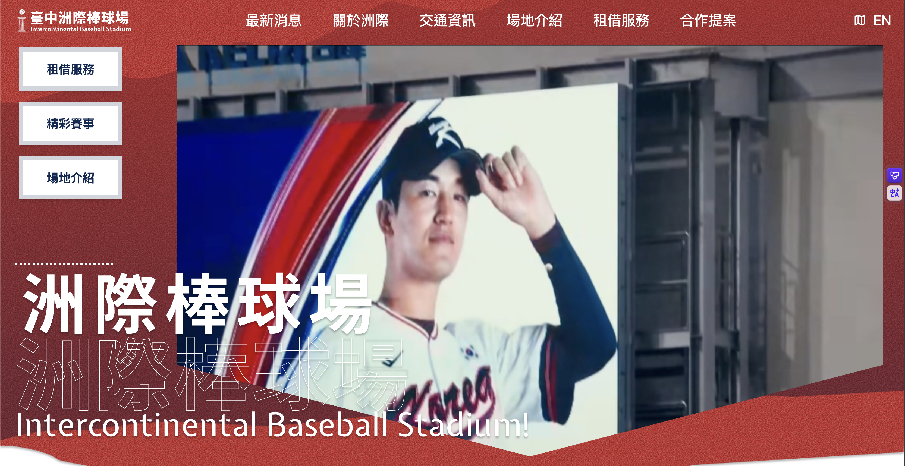

# ⚾ 台中洲際棒球場官方網站改版



## 📋 專案簡介

本專案為台中洲際棒球場官方網站的全面改版。原網站內容平淡、資訊重複散落各頁面，未能有效傳遞場地價值。深入分析後發現，**核心目標用戶並非一般球迷，而是有大型場地租借需求的「活動廠商」**。

因此改版目標除優化首頁外，重點強化**租借服務**與**合作提案**頁面，透過視覺升級與流程優化，讓活動廠商能更直覺地獲取資訊、租借場地。

## 🎯 改版重點

- **重新定義目標用戶**：從球迷轉向活動廠商
- **資訊架構重組**：整合散落頁面的重複資訊
- **流程優化**：簡化場地租借與合作提案路徑
- **視覺升級**：融入棒球元素，強化品牌識別

## ✨ 核心功能

- **場地篩選**：依人數、Hashtag 過濾合適場地
- **收藏功能**：跨頁面同步收藏清單
- **合作提案**：收藏場地自動帶入提案表單
- **球場導覽**：分層展示內場/外圍區域，即時呈現經緯度

## 🛠️ 技術棧
### 🚀 核心框架


### 🎨 前端樣式


### 📦 主要套件


### 🧩 架構設計


## 📦 主要套件

| 套件 | 用途 |
|------|------|
| **Swiper** | 圖片輪播、無間斷跑馬燈 |
| **Rellax** | 視差滾動效果 |
| **SweetAlert2** | 表單送出確認對話框 |
| **Iconify** | 統一圖標管理 |
| **Tailwind CSS** | 實現完全響應式設計 |
| **AOS (Animate On Scroll)** | 滾動進場動畫效果 |

## 🧩 核心技術亮點

### 元件化架構
- 採用可複用元件開發，提升程式碼簡潔度與維護效率
- 透過 Props / emit 實現父子元件資料傳遞

### 狀態管理
使用 Composables 組合式函式管理跨頁面狀態：
- **`useRentalStore`**：場地資料管理、篩選邏輯
- **`useBookmarkStore`**：收藏功能跨頁面同步

**資料流**：租借列表收藏 → 儲存至 BookmarkStore → 合作提案頁讀取顯示

### 視覺設計
- **棒球元素融入**：縫線造型標題、SVG球場平面圖、本壘板Banner
- **沉浸體驗**：紅色顆粒感背景、視差滾動、精彩賽事輪播
- **完全響應式**：手機/平板/桌機完美適配（Tailwind RWD）

## 🔄 功能流程

```
首頁「租借服務」→ 場地租借列表頁
                      ↓
               篩選（人數/Hashtag）
                      ↓
                 收藏場地
                      ↓
       自動帶入合作提案表單
                      ↓
       提案頁顯示已收藏場地標籤
```

## 🚀 線上 Demo


## 📦 本地安裝

```bash
# 克隆專案
git clone https://github.com/Mina-cy/Baseball-Side-Project-3.git

# 進入專案目錄
cd Baseball-Side-Project-3

# 安裝依賴
npm install

# 啟動開發伺服器
npm run dev
```

## 📁 專案結構

```
src/
├── assets/              # 靜態資源（圖片、樣式）
├── components/          # 可複用元件
│   ├── Card.vue
│   ├── Navbar.vue
│   └── ...
├── views/               # 頁面元件
│   ├── HomeView.vue     # 首頁
│   ├── AreaRental.vue   # 場地租借列表
│   └── Cooperation.vue  # 合作提案
├── stores/              # Pinia 狀態管理
│   ├── useRentalStore.js
│   └── useBookmarkStore.js
├── composables/         # 組合式函式
├── router/              # 路由配置
│   └── index.js
└── App.vue
```

## 💡 專案亮點

- **用戶導向設計**：從「活動廠商」需求出發重新規劃功能
- **完整資料串接**：實現收藏跨頁面同步、表單自動帶入
- **沉浸式體驗**：棒球視覺元素貫穿全站，強化品牌識別
- **元件化開發**：提升維護效率，確保開發一致性

## 🔮 未來展望

- 新增線上場地預訂與金流串接
- 整合即時檔期查詢功能
- 優化 SEO 提升搜尋能見度

## 📞 聯絡作者

- **作者**：廖晨妤
- **Email**：minachenyu08@gmail.com
- **GitHub**：[@https://github.com/Mina-cy]
- **作品集**：[https://github.com/Mina-cy/Baseball-Side-Project-3.git]

---

## 📄 授權

MIT License © 2024 廖晨妤

---

> **備註**：本專案為前端練習作品，非官方實際網站。
